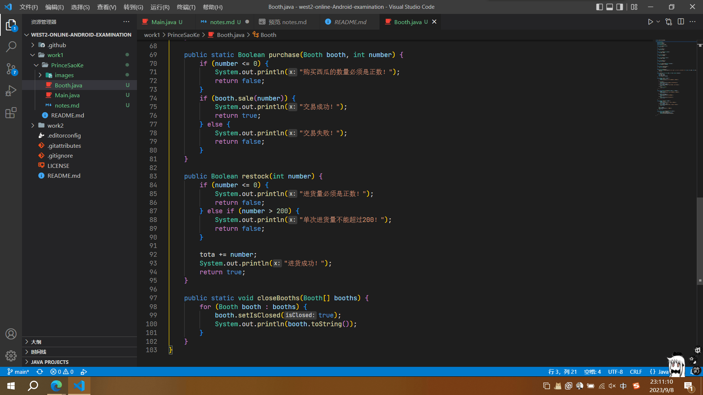
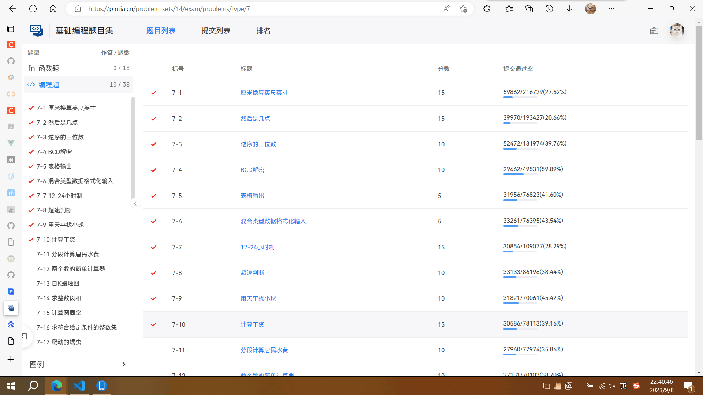

# 第一轮考核

*这次想参加西二在线的考核是因为下决心毕业以后做移动端或者前端了。之前移动端、Web前端和后端都有了解一点，学的比较杂。现在开学进入大三了，深感就业形势的严峻，想早点找个实习提升自己的竞争力，发现移动端的岗位基本都要求懂原生安卓。我之前用框架比较多，原生安卓基本没了解，刚好借西二在线的考核督促自己学习，希望不要半途而废了*

## 搭建JAVA环境

比较早之前弄的，步骤忘记了，也是按网上的教程做的。我的Java版本是20.0.1

IDE用的是VSCode，不为别的，就因为 **VSCode实在是太帅啦！** 在绝对的颜值面前，一切都显得那么苍白无力。VSCode用的我浑身舒畅！

*感受一下这modern的界面，IDEA它能比吗*

## 刷题

作为入门练手题比较简单，没什么好说的，经过大二数据结构的拷打，这些自然不在话下

## 西瓜摊

