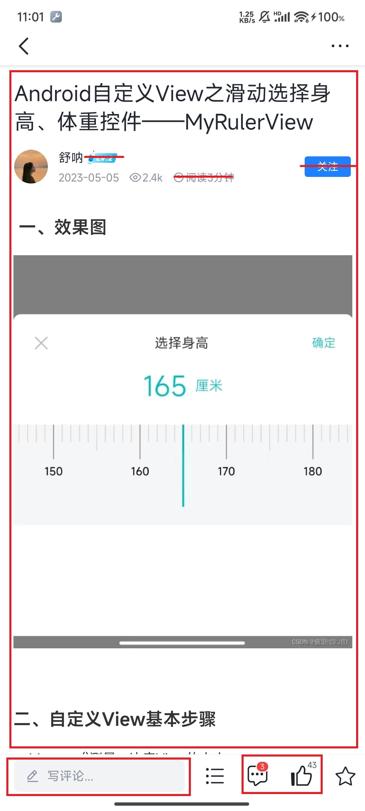
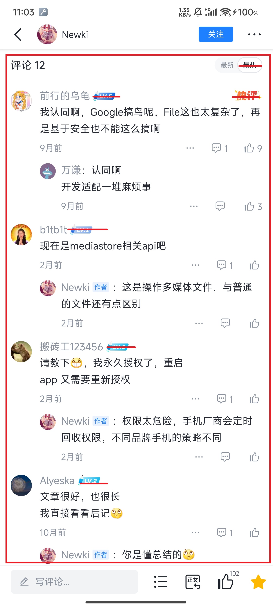
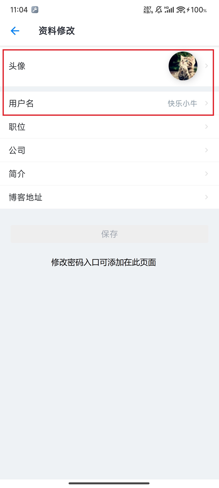

# 西二在线 Android 第四轮考核【合作】

>本轮为第一轮寒假轮考核。今年我们在正式考核前加入了预热环节。

## 目的

- 与后端同学合作，实现安卓与后端对接，实现项目的真正落地

- 熟悉开发流程与规范

## 任务

### Warm Up：实现一个简单的Todolist对接

- 这一步旨在先熟悉一下安卓与后端该如何合作与对接（后端写的接口，安卓端该如何调用，安卓端发送的数据，后端该如何接收），不需要写很复杂，页面简单，能实现基本的待办清单功能即可。

- 这个部分**为期7天**。

### 寒假轮考核：仿一个社区平台——稀土掘金

- 红线涂掉的就是不需要的
- 可以下载“稀土掘金”App体验。界面UI截图供参考，可合理设计。

#### 参考库
- Retrofit2 网络请求框架
- Glide 图片框架
- RecyclerView
- Markdown三方库Markwon: https://github.com/noties/Markwon （也可以用其他的，甚至自行实现）

#### 考核内容

1. 首页

    文章榜：按点击量降序

    最新：最新发布的文章

    写文章入口：点击之后进入文章编辑界面

    “我”入口：提供进入“我的主页”的入口

    

2. 文章页

    内容展示：Markdown 解析与渲染

    点赞、收藏按钮：点赞收藏文章

    评论功能：普通文本评论即可，不用加表情/图片/链接等，要求带子评论

    

    

    

3. 我的主页

    个人简介

    我写的文章
    
    我点赞的文章

    进入资料编辑页按钮
    
    

    

4. 设置页

    支持修改用户名

    支持修改密码

    支持修改头像

    

5. 写文章界面

    拥有文章标题
    
    支持Markdown编写，且支持实时预览
    
    发布按钮
    
    其他都不需要

    

## Bonus

> 这些内容和组队的后端同学讨论后，自行选择性完成

1.	除了可以写文章，还有草稿箱：暂存写到一半的文章

2.	支持文章目录功能（点击后可以跳转到同一页面的位置）

3.	允许多层嵌套评论（现有的网站⼤多数使⽤二级评论，没有做到真正的多级）

4.	支持搜索功能（模糊搜索）

5.	点赞使用缓存处理，不要求很难的逻辑

## 提醒
1. 内容较多，把握时间。

2. 任何疑问，积极提出。

3. 注意规范，项目结构。
